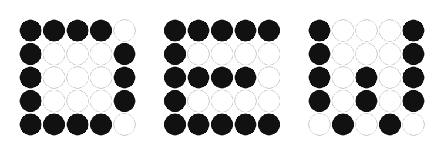
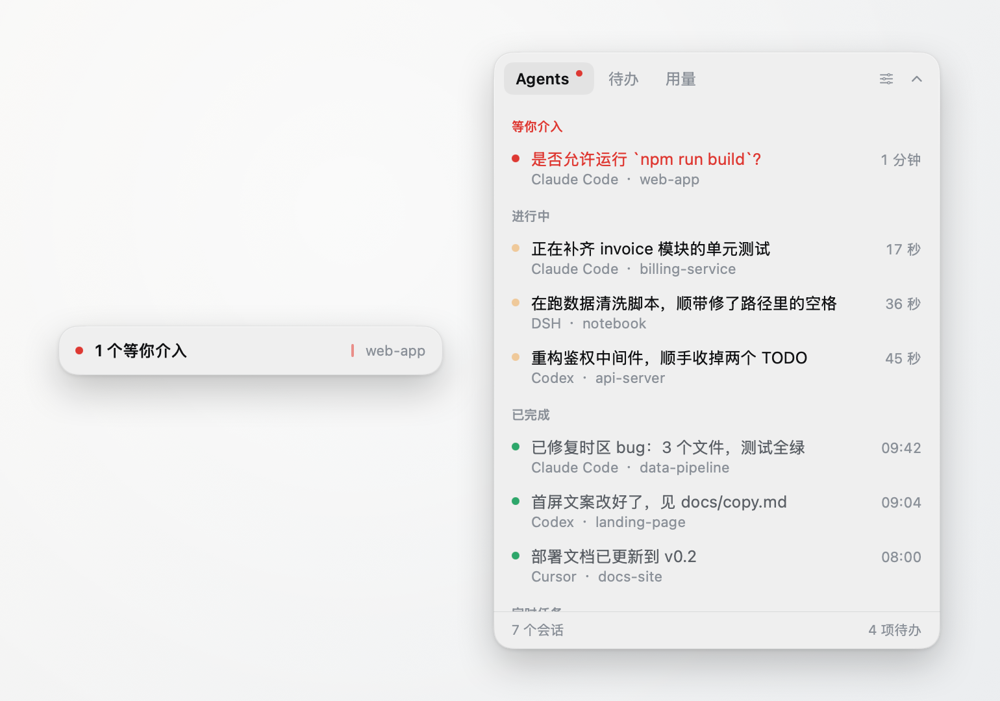
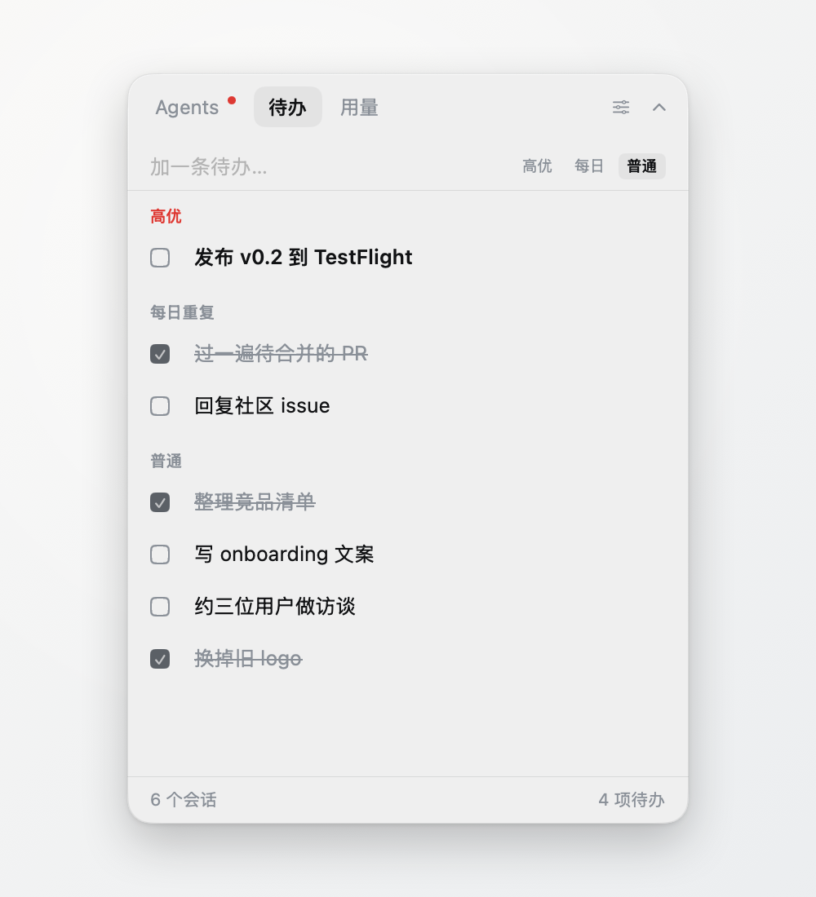

<p align="center">
  <picture>
    <source media="(prefers-color-scheme: dark)" srcset="assets/logo/dew-dotgrid-dark.svg">
    
  </picture>
</p>

<p align="center">
  一条常驻桌面、可折叠的极简状态条：左边管所有 AI Agent 的活，右边管自己的活。<br>
  <sub>A tiny always-on-top macOS bar that shows what your coding agents (Claude Code / Codex / Cursor) are doing — plus your own to-dos. Read-only, local, no account.</sub>
</p>

<p align="center">
  
</p>

---

## 它解决什么

同时跑多个 Agent 时，你不知道哪个在跑、哪个跑完了、哪个**卡住在等你授权**——只能挨个切窗口看。定时任务什么时候触发也没有任何可视化。

Dew 把这些压成**一行**：折叠态只显示最需要你介入的那一件事；展开才看全部。

| 折叠态信号（按优先级） | 示例 |
|---|---|
| 等你介入 | `⏸ 1 个等你授权` |
| 已完成待查看 | `✓ 2 个已完成` |
| 进行中 | `▶ 3 个进行中` |
| 全部空闲 | `全部空闲` |

## 功能

- **Agents** — 每个会话一行：项目名、来源、状态 + 持续时长、最后一条动作摘要。点击跳回对应的桌面端（`claude://resume` / `codex://threads` / `cursor://file`），没有深链就退回 Finder 定位日志。
- **定时任务** — Claude Code `scheduled-tasks` 与 Codex `automations`，显示下次触发时间（cron / RRULE 本地求值）。
- **To-do** — 高优 / 普通 / 每日重复 三类，键盘优先，纯本地 JSON。

  

- **用量** — Codex 真实额度（来自会话日志）、Claude Code 本地 token 累计；可选开启官方额度接口（默认关，详见下）。
- 中 / 英文切换，透明度可调，位置自动记忆，菜单栏入口，不占 Dock。

## 支持的 Agent

| Agent | 会话状态 | 等你介入 | 定时任务 | 额度 | 数据源 |
|---|:-:|:-:|:-:|:-:|---|
| Claude Code | ✅ | ✅ | ✅ | ✅ | `~/.claude/projects/**/*.jsonl`、`~/.claude/scheduled-tasks/` |
| Codex | ✅ | ✅ | ✅ | ✅ | `~/.codex/sessions/`、`~/.codex/automations/` |
| Cursor | ✅ | 推断 | — | — | `~/.cursor/projects/<slug>/agent-transcripts/` |
| Antigravity | roadmap | | | | 会话正文加密，暂未启用 |

**全部只读，绝不写入任何 Agent 的数据目录。** 接新 Agent 只需实现一个 `AgentAdapter`，UI 与 store 层零改动——见 [app/README.md](app/README.md#接入新-agent)。

## 安装

要求：**macOS 14 (Sonoma) 或更新，Apple Silicon（M 系列芯片）**。Intel Mac 暂未提供构建。

### 方式一：下载安装（推荐）

1. 到 [Releases](https://github.com/cinderzhan/dew/releases/latest) 下载 `Dew-<版本>.zip`，解压得到 `Dew.app`。
2. 把 `Dew.app` 拖进「应用程序」文件夹。
3. **第一次打开**需要绕过 Gatekeeper——Dew 目前是自签名、未经 Apple 公证，系统默认会拦：
   - **macOS 15 (Sequoia)**：双击 `Dew.app`，看到「无法打开」先点「完成」，然后打开 **系统设置 → 隐私与安全性**，拉到底部点 **「仍要打开」**，再确认一次。
   - **macOS 14 (Sonoma)**：在访达里 **右键 → 打开**（不是双击），弹窗里选「打开」。
   - 或者直接在终端清掉隔离标记，一步到位：
     ```bash
     xattr -cr /Applications/Dew.app
     ```

   只需要做一次，之后正常双击即可。
4. 打开后**没有 Dock 图标**：桌面上会出现一条小横条（折叠态），菜单栏右侧多一个 💧 水滴图标。点横条展开面板，`Esc` 或右上角箭头收起，拖动横条可以挪位置。

> 为什么要这么折腾？正式的 Developer ID 签名 + 公证需要付费开发者账号，这个项目暂时走的是免费路线。代码全开源，不放心可以按方式二自己编译。

### 方式二：从源码构建

需要 Xcode Command Line Tools（`xcode-select --install`）。

```bash
git clone https://github.com/cinderzhan/dew.git
cd dew/app
./build.sh          # 产物 build/Dew.app
open build/Dew.app
```

不依赖 SwiftPM，`build.sh` 直接调 `swiftc` 组 bundle；自己编译的包不会触发 Gatekeeper 拦截。要打一个可以发给别人的 zip 用 `./dist.sh`。环境坑、签名身份、调试开关等见 [app/README.md](app/README.md)。

### 卸载

删掉 `Dew.app`，再删 `~/Library/Application Support/Dew/`（只有一个 `todos.json`）。Dew 不往别处写任何东西。

## 关于隐私

- 自己的数据只有一份：`~/Library/Application Support/Dew/todos.json`。
- 「读取 Claude 官方额度」**默认关闭**。开启后才会从钥匙串读 Claude Code 自己的登录凭据，只发往 `api.anthropic.com`，凭据只存内存、不落盘、不记日志。这是未公开接口，可能随 Claude 更新失效。
- 不联网、无账号、无遥测（上面那个可选开关除外）。

## 仓库结构

```
app/            macOS 应用源码与构建脚本（Swift / AppKit + SwiftUI）
assets/logo/    图标与 LOGO 源文件（SVG / icns），render-icon.sh 重新生成图标
PRD.md          产品定义、状态语义、各 Agent 数据源实测记录
skins.html / visual-directions.html   早期视觉方向探索稿
```

## License

[MIT](LICENSE)
